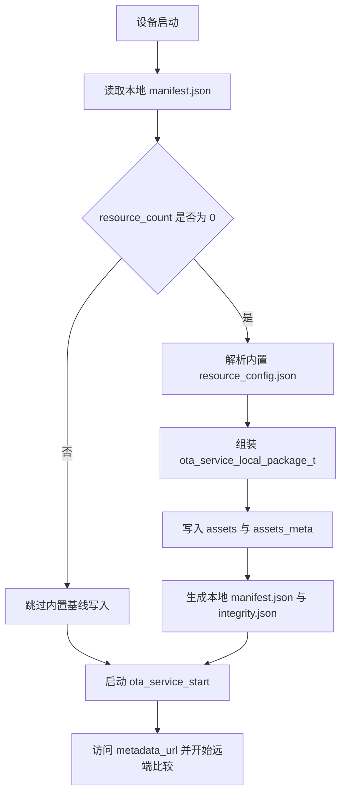
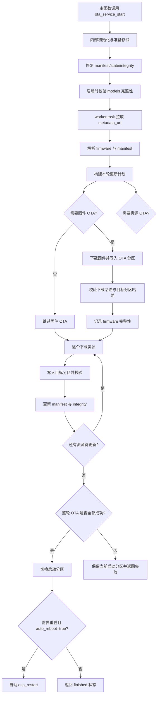

## OTA 开发文档

本文档说明 `ota_service` 当前已经落地并通过联调的实现方案，重点覆盖：

- 组件目标与边界
- 本地存储与完整性模型
- 远端 OTA 协议
- 固件 OTA 与资源 OTA 的执行流程
- 重试、校验、切分区与状态模型
- 示例工程中的内置资源基线接入方式

## 1. 设计目标

`ota_service` 的目标是把 OTA 复杂度尽量收敛到组件内部。

主程序只负责：

- 配置 `metadata_url`
- 调用 `ota_service_start()`
- 轮询 `ota_service_get_status()`
- 根据 `reboot_pending` 或 `ota_service_is_finished()` 决定后续业务流程

组件内部负责：

- 挂载 `assets` / `assets_meta`
- 准备和修复本地控制文件
- 拉取统一 OTA 地址
- 解析总 JSON
- 比较固件与资源版本
- 执行固件 OTA
- 执行资源逐文件 OTA
- 维护本地清单、事务状态和完整性记录
- 输出当前文件进度与下载速度

## 2. 存储模型

当前方案围绕以下分区工作：

```csv
ota_0,       app,  ota_0,      0x10000,  0x400000,
ota_1,       app,  ota_1,      0x410000, 0x400000,
models,      data, ,           0x810000, 0x200000,
assets,      data, littlefs,   0xA10000, 0x5A3000,
assets_meta, data, littlefs,   0xFB3000, 0xA000,
```

含义如下：

- `ota_0` / `ota_1`：固件 OTA 双分区
- `models`：原始分区资源，适合大模型或 `mmap` 场景
- `assets`：LittleFS 资源分区，保存文本、配置、素材等文件
- `assets_meta`：LittleFS 控制面分区，保存本地索引、事务状态和完整性记录

### 2.1 assets 分区

`assets` 中保存实际资源文件，例如：

- `/assets/texts/test_0.txt`
- `/assets/configs/test_1.json`

`access = littlefs` 的资源最终都会按逻辑路径写入这里。

### 2.2 models 分区

`models` 当前是唯一的 `mmap` 原始分区。

`access = mmap` 或 `partition = "models"` 的资源，会写入该原始分区指定偏移位置。

为了避免更新过程中断导致“本地版本记录正常，但原始分区内容已损坏”的情况，组件会在启动时重新校验本地 `models` 聚合哈希；如果校验不通过，会强制把对应资源重新纳入 OTA 计划。

### 2.3 assets_meta 分区

`assets_meta` 中保存三个关键文件：

- `manifest.json`
- `state.json`
- `integrity.json`

作用如下：

- `manifest.json`：表示“当前设备已经安装了哪些资源、版本和哈希是什么”
- `state.json`：表示“当前事务进行到哪一步、最近失败目标是谁、已重试多少次”
- `integrity.json`：表示“当前固件和 `models` 分区的完整性基线”

## 3. 控制文件与自动重建

### 3.1 manifest.json

`manifest.json` 是本地资源清单，核心字段包括：

- `format_version`
- `firmware_compat`
- `manifest_version`
- `resource_count`
- `resources[]`

每个资源条目通常包含：

- `name`
- `type`
- `version`
- `partition`
- `access`
- `path`
- `offset`
- `size`
- `reserved_size`
- `sha256`
- `required`

这份清单既是本地资源状态记录，也是后续和服务端比较的基线。

### 3.2 state.json

`state.json` 保存当前事务上下文，典型字段包括：

- 当前事务状态
- 目标清单版本
- 当前目标资源名
- 当前目标分区
- 当前目标资源哈希
- `retry_count`

事务状态包括：

- `idle`
- `downloading`
- `writing`
- `verifying`
- `failed`

### 3.3 integrity.json

`integrity.json` 用于保存完整性基线，当前包含两类信息：

- `firmware`：最近一次通过校验的 OTA 固件版本、大小和分区哈希
- `models`：本地 `models` 资源聚合校验值

作用如下：

- 固件写入 OTA 分区后，先校验目标分区内容，再允许后续切换启动分区
- 设备启动时重新校验本地 `models`，校验失败则强制对应资源重新 OTA

### 3.4 缺失或损坏时的恢复策略

`manifest.json`、`state.json`、`integrity.json` 如果出现以下任一情况：

- 文件不存在
- JSON 内容损坏
- 关键字段缺失导致无法正常解析

组件都会自动按默认值重建。

默认策略：

- 版本字段回落为 `0.0.0`
- 状态回落为 `idle`
- 完整性记录回落为空基线

这样可以避免因为 `assets_meta` 控制文件异常导致 OTA 组件在初始化阶段直接失效。

## 4. 远端协议模型

组件只访问一个 `metadata_url`，例如：

```c
ota_service_config_t config = ota_service_get_default_config();
config.metadata_url = "http://192.168.3.198:8000/ota/metadata";
```

服务端返回一个总 JSON，内部包含：

- `firmware`
- `manifest`

示例：

```json
{
  "protocol_version": 1,
  "firmware": {
    "version": "1.0.2",
    "url": "http://192.168.3.198:8000/firmware/BLE_TEST.bin",
    "sha256": "0123456789abcdef0123456789abcdef0123456789abcdef0123456789abcdef",
    "size": 1048576,
    "mandatory": false,
    "description": "BLE_TEST firmware 1.0.2 test release"
  },
  "manifest": {
    "format_version": 2,
    "firmware_compat": "1.0.1",
    "manifest_version": "1.0.1",
    "resources": [
      {
        "name": "test_text",
        "type": "text",
        "version": "1.0.2",
        "partition": "assets",
        "access": "littlefs",
        "path": "/texts/test_0.txt",
        "size": 3194,
        "sha256": "aaaaaaaaaaaaaaaaaaaaaaaaaaaaaaaaaaaaaaaaaaaaaaaaaaaaaaaaaaaaaaaa",
        "required": true
      }
    ]
  }
}
```

约定如下：

- `protocol_version` 当前固定为 `1`
- `firmware` 可省略，表示本轮不做固件 OTA
- `manifest` 可省略，表示本轮不做资源 OTA
- `manifest.resources[]` 的结构与本地 `manifest.json` 基本一致

资源下载地址不必在清单中逐个提供完整 URL，组件内部按 `metadata_url` 自动推导：

- `assets` 资源：`/assets{path}`
- `models` 资源：`/models{path}`

## 5. 版本比较与更新判定

版本比较统一使用 `dxbsw/version_checker:^1.0.0`。

因此版本号应满足：

- 纯数字
- 3 段或 4 段
- 推荐格式 `1.0.0` 或 `1.0.0.1`

判定规则如下：

1. 固件：远端 `firmware.version` 大于当前固件版本时更新
2. 资源：本地没有该资源时更新
3. 资源：目标版本大于当前版本时更新
4. 资源：目标版本等于当前版本但元数据变化时更新
5. 资源：目标版本小于当前版本时跳过，不执行降级
6. 资源：如果 `manifest.firmware_compat` 高于当前固件版本，则本轮资源 OTA 视为不兼容
7. `models`：如果本地完整性校验失败，即使版本相同也会强制更新

元数据变化包括：

- 分区变化
- 访问方式变化
- 路径变化
- 大小变化
- 哈希变化
- 原始分区资源的 `offset` / `reserved_size` 变化

## 6. 内置资源基线

当前示例工程在 `main/main.c` 中增加了内置资源基线机制。

它的目的不是替代 OTA，而是为设备首次启动提供一个可靠的本地比较基线。

### 6.1 基线来源

基线来源于：

- `main/assets/resource_config.json`
- `main/assets/test_0.txt`
- `main/assets/test_1.json`

这些文件通过 `EMBED_TXTFILES` 嵌入固件。

### 6.2 初始化规则

主程序启动 OTA 前先执行：

1. 读取本地 `manifest.json`
2. 若 `resource_count == 0`，说明设备本地还没有资源基线
3. 解析内置 `resource_config.json`
4. 调用 `ota_service_apply_local_package()` 写入 `assets` 和 `assets_meta`
5. 生成本地 `manifest.json` 与 `integrity.json`
6. 后续再启动远端 OTA 检查

也就是说，设备首次比较的基线先来自固件内部，而不是先来自服务器。

### 6.3 初始化流程



## 7. 自动 OTA 总流程

组件通过一个后台 worker task 执行一轮 OTA。

特点如下：

- 每次 `ota_service_start()` 创建一个后台 task
- task 跑完一轮检查/更新后自行退出
- 下次若还要检查 OTA，需要再次调用 `ota_service_start()`
- 如果组件已初始化且后台 task 未运行，再次调用 `ota_service_start(config)` 可以刷新运行配置

整体流程如下：



## 8. 固件 OTA 细节

固件 OTA 的判断条件为：

- 远端 `firmware.version` 大于当前固件版本

执行要点：

- 使用 `esp_http_client` 流式下载固件
- 使用 `esp_ota_begin()` / `esp_ota_write()` / `esp_ota_end()` 写入更新分区
- 下载过程中持续上报文件总大小、已下载字节数和速度
- 先校验下载流的 `sha256`
- 再对目标 OTA 分区中的实际内容进行二次 `sha256` 校验
- 只有当固件校验成功、资源更新也成功后，才会调用 `esp_ota_set_boot_partition()`
- 若本轮涉及固件或资源更新，`reboot_pending` 置位
- 若 `auto_reboot = true`，组件结束时自动重启

这样可以避免出现“固件已经写好，但资源失败，设备下次重启静默进入新固件”的不一致状态。

## 9. 资源 OTA 细节

资源 OTA 先由更新计划筛出目标列表，再按资源类型分别处理。

### 9.1 LittleFS 资源

`access = littlefs` 的资源流程如下：

1. 根据 `path` 构建下载地址
2. 下载目标文件
3. 写入 `/assets/...` 对应路径
4. 计算文件 `sha256`
5. 校验通过后更新本地 `manifest.json`

### 9.2 原始分区资源

`access = mmap` 的资源流程如下：

1. 找到目标分区
2. 以 4KB 对齐方式擦除
3. 按 4KB 分块下载与写入
4. 计算分区内容 `sha256`
5. 校验通过后更新本地 `manifest.json`
6. 刷新 `integrity.json` 中的 `models` 聚合校验值

### 9.3 资源更新原则

资源是逐文件串行更新的：

- 先完成一个资源的下载、写入、校验
- 成功后再进入下一个资源
- 任一资源失败，本轮 OTA 进入失败状态
- 本轮 OTA 最多自动重试 `3` 次，超过后报错退出

## 10. 状态、日志与重试模型

### 10.1 事务状态

`state.json` 中的事务状态枚举为：

- `idle`
- `downloading`
- `writing`
- `verifying`
- `failed`

### 10.2 运行阶段

运行阶段对应 `ota_service_runtime_state_t`：

- `IDLE`
- `PREPARING`
- `CHECKING`
- `FIRMWARE_OTA`
- `ASSETS_OTA`
- `COMPLETED`
- `NO_UPDATE`
- `FAILED`
- `REBOOT_REQUIRED`

### 10.3 对外状态字段

主程序关注的字段主要有：

- `busy`
- `need_ota`
- `success`
- `reboot_pending`
- `completed_steps`
- `total_steps`
- `current_target`
- `current_version`
- `target_version`
- `current_file_size`
- `current_file_downloaded`
- `current_speed_bytes_per_sec`
- `last_error`
- `plan`

这些字段适合直接做串口日志输出或上层状态机联动。

### 10.4 日志策略

OTA 日志当前偏向“简洁可读”：

- 连接服务器并拿到计划后，先打印固件 OTA 结论
- 然后打印本轮真正需要更新的资源列表
- OTA 进行中按当前文件打印进度和速度

输出重点包括：

- 固件是否需要 OTA
- 目标版本是多少
- 哪些资源需要更新
- 当前文件进度和下载速度

## 11. PSRAM 使用策略

为了降低 OTA 过程中对内部 RAM 的压力，组件优先将下载缓冲放入 PSRAM。

策略如下：

- 优先 `heap_caps_malloc(MALLOC_CAP_SPIRAM | MALLOC_CAP_8BIT)`
- 申请失败时回退普通 RAM
- 固件下载和资源下载都复用这套策略

这使得大文件下载场景下更稳定，尤其适合 ESP32-S3 + PSRAM 配置。

## 12. Python 服务端设计

当前联调用服务端位于：

- `python_tool/ota_server.py`
- `python_tool/ota_server_config.json`

目录结构如下：

```text
python_tool/
├── ota_server.py
├── ota_server_config.json
└── server_data/
    ├── firmware/
    ├── models/
    ├── assets/
    └── generated/
```

职责划分：

- `server_data/firmware`：固件文件
- `server_data/models`：模型或原始分区资源
- `server_data/assets`：LittleFS 资源文件
- `server_data/generated`：服务启动后自动生成的输出文件

`ota_server_config.json` 负责定义：

- 协议版本
- 资源清单版本
- 固件版本
- 每个模型的版本
- 每个资源的版本
- 资源文件路径映射

服务端启动后自动：

- 读取配置
- 扫描真实文件
- 计算大小和 `sha256`
- 生成 `manifest.json`
- 生成 `metadata.json`
- 生成 `version.json`

如果 `models` 为空数组，服务端会直接跳过 `models` 清单生成，不会因为“没有 models 文件”而阻塞整个 OTA 服务。

## 13. 当前联调结论

当前工程已经完成以下联调闭环：

- 固件版本比较成功
- 固件 OTA 写入成功
- 固件目标分区二次校验成功
- 整轮 OTA 成功后再切换启动分区
- 资源版本比较成功
- 资源文件逐个下载、写入、校验成功
- `models` 完整性异常时可强制重新 OTA
- 控制文件损坏或缺失时可自动重建
- OTA 完成后可根据配置自动重启
- 无需 OTA 时可继续进入应用流程并打印资源文件内容

因此当前文档描述的是“已实现并已验证”的方案，不再是仅停留在设计层的规划稿。
